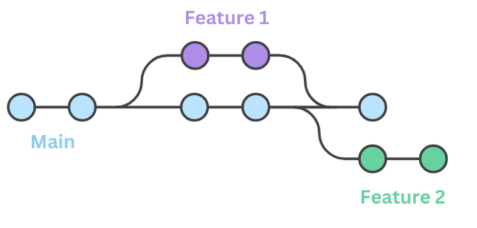

# Git 协作流程详解

本文档详细介绍了包括mkdocs静态网站Hands-On在内的Git协作流程，包括分支管理、代码审查、发布流程等。
mkdcos与普通git项目的主要区别在于一个独立的gh-pages分支，无需管理自动根据main生成site设置。
[git_learning_resource](https://www.runoob.com/git/git-tutorial.html)
[git_standard](https://blog.csdn.net/weixin_42092278/article/details/90448721)
## 分支策略

### 主分支
- **main**: 主分支，包含稳定的文档源码
- **gh-pages**: 自动生成的发布分支，包含构建产物

### 功能分支命名规范
```
<类型>/<描述>
```

类型前缀：
- `docs/`: 文档相关修改
- `feat/`: 新功能开发
- `fix/`: 错误修复
- `chore/`: 维护性任务
- `refactor/`: 代码重构
- `style/`: 代码格式调整

示例：
- `docs/add-simulator-guide`
- `feat/add-contributor-stats`
- `fix/navigation-display-issue`

## 详细协作流程
git的简要原理如下图所示：

在 master/main 外建立分支，开发功能验证后再合并，一直维持一份正确的版本。


### 1. 环境准备

#### 克隆仓库
```bash
git clone git@github.com:MQ-Group/Hands_On.git
cd Hands_On
```

#### 配置用户信息
```bash
git config user.name "Your Name"
git config user.email "your.email@example.com"
```

#### 设置上游仓库
```bash
git remote add upstream git@github.com:MQ-Group/Hands_On.git
git remote -v  # 验证配置
```

### 2. 开发流程

#### 更新本地主分支
```bash
git checkout main
git fetch upstream
git merge upstream/main
# 或使用 rebase
git rebase upstream/main
```

#### 创建功能分支
```bash
git checkout -b docs/add-new-tutorial
```

#### 开发过程中的提交
```bash
# 查看状态
git status

# 添加文件
git add docs/tutorials/new_tutorial.md

# 提交（遵循 Conventional Commits）
git commit -m "docs: add new tutorial for advanced topics"

# 推送分支
git push -u origin docs/add-new-tutorial
```

#### 保持分支同步
```bash
# 定期从主分支拉取更新
git fetch upstream
git rebase upstream/main

# 解决冲突（如果有）
git add <resolved-files>
git rebase --continue
```

### 3. 代码审查流程

#### 创建 Pull Request
1. 在 GitHub 上点击 "New Pull Request"
2. 选择正确的分支
3. 填写详细的 PR 描述
4. 添加相关标签和审查者

#### PR 描述模板
```markdown
## 变更描述
简要描述本次变更的内容和目的。

## 变更类型
- [ ] 文档更新
- [ ] 新功能
- [ ] 错误修复
- [ ] 重构
- [ ] 其他

## 测试
- [ ] 本地构建通过 (`mkdocs build`)
- [ ] 本地预览正常 (`mkdocs serve`)
- [ ] 导航链接正确
- [ ] 无死链或格式错误

## 相关 Issue
Closes #<issue-number>

## 截图（如适用）
添加相关截图说明变更效果。
```

#### 审查检查清单
- [ ] 代码/文档质量符合项目标准
- [ ] 提交信息清晰规范
- [ ] 无语法错误或死链
- [ ] 导航结构正确
- [ ] 遵循项目约定

### 4. 合并策略

#### 合并前检查
```bash
# 确保分支是最新的
git checkout main
git pull upstream main

# 切换到功能分支
git checkout docs/add-new-tutorial

# 变基到最新主分支
git rebase upstream/main
```

#### 合并选项
1. **Squash and Merge**: 将多个提交合并为一个
2. **Rebase and Merge**: 保持提交历史线性
3. **Create a Merge Commit**: 保留分支历史

推荐使用 **Squash and Merge** 保持主分支历史清晰。

### 5. 发布流程

#### 自动发布
- 合并到 `main` 分支后，GitHub Actions 自动触发
- 构建文档并发布到 `gh-pages` 分支
- 更新 GitHub Pages 站点

#### 手动发布（管理员）
```bash
# 构建并发布
mkdocs gh-deploy --force

# 验证发布
git checkout gh-pages
git log --oneline -5
```

### 6. 版本管理

#### 版本号规范
遵循 [Semantic Versioning](https://semver.org/)：
- **主版本号**: 重大架构变更
- **次版本号**: 新功能添加
- **修订号**: 错误修复

#### 发布标签
```bash
# 创建版本标签
git tag -a v1.2.0 -m "Release version 1.2.0"
git push origin v1.2.0
```

#### 更新日志
- 在 `changelog.md` 中记录所有变更
- 按照时间倒序排列
- 使用统一的格式和表情符号

## 高级协作技巧

### 1. 处理大型变更

#### 分步提交
```bash
# 将大型变更分解为多个小提交
git add docs/tutorials/part1.md
git commit -m "docs: add tutorial part 1 - basics"

git add docs/tutorials/part2.md
git commit -m "docs: add tutorial part 2 - advanced"

git add docs/tutorials/part3.md
git commit -m "docs: add tutorial part 3 - examples"
```

#### 交互式变基
```bash
git rebase -i HEAD~3  # 编辑最近3个提交
```

### 2. 协作冲突解决

#### 预防冲突
- 频繁同步主分支
- 保持功能分支小而专注
- 及时沟通变更计划

#### 解决冲突
```bash
# 拉取最新变更
git fetch upstream
git rebase upstream/main

# 解决冲突文件
# 编辑冲突文件，删除冲突标记

# 添加解决的文件
git add <resolved-files>

# 继续变基
git rebase --continue
```


## 常见问题解决

### Q: 如何撤销错误的提交？
```bash
# 撤销最后一次提交（保留更改）
git reset --soft HEAD~1

# 撤销最后一次提交（丢弃更改）
git reset --hard HEAD~1

# 撤销到指定提交
git reset --hard <commit-hash>
```

### Q: 如何修改提交信息？
```bash
# 修改最后一次提交信息
git commit --amend -m "新的提交信息"

# 修改多个提交信息
git rebase -i HEAD~3
```

### Q: 如何恢复删除的文件？
```bash
# 查看删除的文件
git log --oneline --follow -- <file-path>

# 恢复文件
git checkout <commit-hash> -- <file-path>
```

### Q: 如何处理敏感信息泄露？
```bash
# 从历史中完全删除文件
git filter-branch --force --index-filter \
  'git rm --cached --ignore-unmatch <file-path>' \
  --prune-empty --tag-name-filter cat -- --all

# 强制推送
git push origin --force --all
```


### 有用命令
```bash
# 查看提交历史
git log --oneline --graph --all

# 查看文件变更
git diff HEAD~1

# 查看分支状态
git status -sb

# 查看远程分支
git branch -r

# 清理本地分支
git branch -d <branch-name>
```

---

*最后更新：{{ git_revision_date_localized }}*
