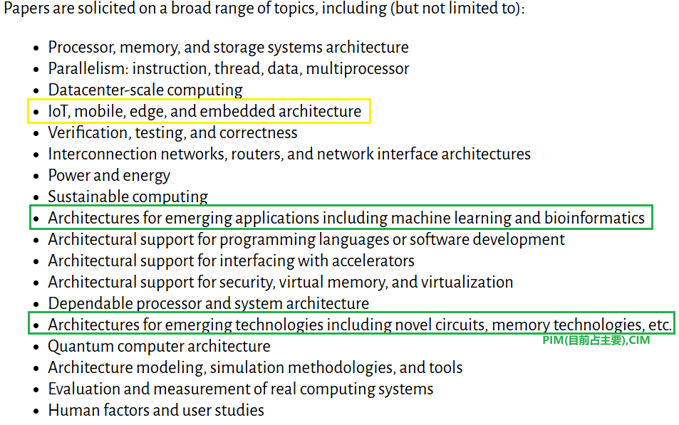
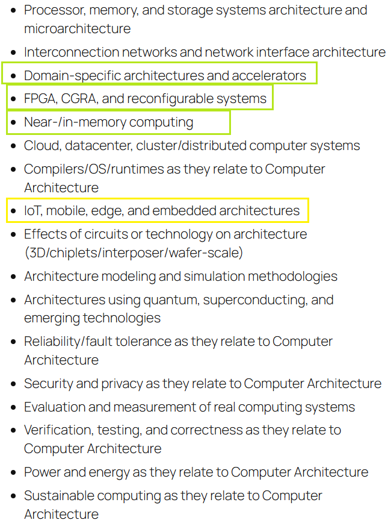
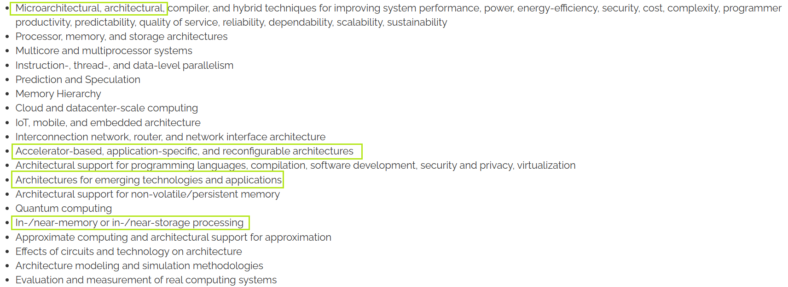

# 体系结构顶会介绍

清华汪玉和上交戴国浩组在维持的加速器汇总网站：
[Accelerator Project](https://dai.sjtu.edu.cn/project.html)

## 四大体系结构会议

### ISCA (International Symposium on Computer Architecture) [ISCA](https://iscaconf.org/)
[我来（经筛选）论文链接](https://www.wolai.com/7UtmF8ZAxGPNY2NkxkTn7b)

### MICRO (International Symposium on Microarchitecture) [MICRO](https://www.microarch.org/)
[我来（经筛选）论文链接](https://www.wolai.com/swLPvU6QHCgUuGNtv8Ze1x)

### ASPLOS (Architectural Support for Programming Languages and Operating Systems) [ASPLOS](https://asplos-conference.org/) 
[我来（经筛选）论文链接](https://www.wolai.com/ciBGAxbzRyyaziztZACmhe)

### HPCA (International Symposium on High-Performance Computer Architecture)
[HPCA](https://hpca-conf.org/)
[我来（经筛选）论文链接](https://www.wolai.com/21fPF1ZfLnXJj7qi9fAERG)

- **DDL**:  
  4月份 MICRO，ASPLOS(Spring)  
  7月份 HPCA  
  8月份 ASPLOS(Summer)  
  11月份 ISCA,ASPLOS
- **投稿要求**: 
  - **论文长度**：12页正文（一般为intro+backg.3页，方法6页，evulation3页） + 参考文献
  \* 其中相对来说ISCA内容最多（大多数文章使用小一号的9pt字体，结果图也密度更高），难度也最高
  - **双盲评审**，审稿人>5（Rebuttle 负担比较大）
  - **ASPLOS**主要为**ACM**，**HPCA**主要为**IEEE**，另外两个**ACM/IEEE**轮换
  - **接受数量** isca 220~, ASPLOS 100~(V1,V2,V3)~, HPCA 110~, MCIRO 110~
  
**Rebuttle**: 出分后有3-4/7-14天时间回复审稿人疑问，MICRO与ASPLOS可以根据疑问或意见提交修订版

## Evulation的对比对象
\***Accelator**一般与同类型的比（评估方式最好对齐），也可以与**GPU/CPU**比。

## Session的选择
体系结构会议中，与我们最相关的session一般是**ML Accelerator**与**Application Accelerator/Domain-Specific Architectures**，如果是**CIM**或**PIM**等特殊架构会有专门的session，如果是纯粹的微架构优化也会有专门的session。

ISCA的相对应session如下图所示：

**HPCA:**

**MICRO:**

## 量化/稀疏/其他常规方法加速器
量化稀疏或其他加速的方法可能很简单就说清楚了，但要是说明为什么有用，怎么有用，证明有用会麻烦很多。
**考虑细节**，大量篇幅解释，超多结果证明。
**常见的几种量化/稀疏相关工作：**
- **非常规的量化/稀疏计算方式**  
  - 例如串行bit级稀疏等新颖方法，但通常需要解决复杂的控制逻辑和实现代价。
- **极致的微架构/系统级/指令调度优化**  
  - 通过极致的硬件微架构、系统层面或指令调度优化实现高效加速（Solid，至少看起来）。
- **全新应用方向**  
  - 另辟蹊径，跳出现有accelerator赛道，针对全新应用场景提出创新性加速方案。

## Artifact Evaluation (AE)
### 什么是 Artifact Evaluation？
Artifact Evaluation 是近年来在计算机体系结构会议中越来越重要的环节，旨在评估论文中描述的系统、工具或数据的可重现性。

### AE 流程

#### 1. 准备阶段
- **时间**: 论文提交后1-2周内
- **任务**: 准备可重现的代码、数据和文档
- **要求**: 
  - 提供完整的源代码
  - 包含详细的安装和使用说明
  - 提供测试数据和预期结果
  - 确保在标准环境中可运行

#### 2. 评审阶段
- **时间**: 通常2-4周
- **评审内容**:
  - 功能正确性：代码是否按论文描述工作
  - 可重现性：其他研究者能否重现结果
  - 文档质量：说明文档是否清晰完整
  - 可用性：工具是否易于使用

#### 3. 结果通知
- **时间**: 会议通知前1-2周
- **结果类型**:
  - **Available**: 完全可用，可重现
  - **Functional**: 基本功能可用，部分问题
  - **Reusable**: 可重用，但需要修改
  - **Unavailable**: 不可用

### 各会议的 AE 政策

#### ISCA
- AE 是**可选**的，但强烈推荐
- 提供 "Artifacts Available" 徽章
- 评审过程相对严格

#### MICRO
- AE 是**可选**的
- 提供多种徽章（Available, Functional, Reusable）
- 注重工具的实际可用性

#### ASPLOS
- AE 是**可选**的
- 强调跨领域工具的可重现性
- 支持多种类型的 artifact

#### HPCA
- AE 是**可选**的
- 关注高性能计算工具的性能
- 提供详细的评审反馈

### AE 常见问题

#### Q: AE 失败会影响论文接受吗？
A: 通常不会直接影响论文接受，但会影响论文的最终评级和影响力。

---

*最后更新：{{ git_revision_date_localized }}*

